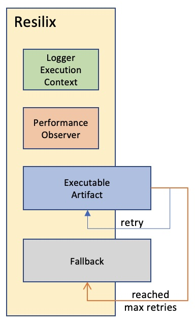

# Asurion SBX Resilix 
### (FEATURE CANDIDATE LIBRARY)



## Table of Contents

1. [Introduction](#introduction)
2. [Usage](#usage)
3. [API Reference](#api-reference)
4. [Examples](#examples)
5. [Decorator](#decorator)
6. [Logging](#logging)

## Introduction

The `Resilix` is a TypeScript implementation of a module that provides resilience features for job processing. It is designed to handle retries, fallback mechanisms, logging for various job processing scenarios and building dashboards with real-time KPIs and information about the call execution. 

In addition, it also includes an observer that collects performance metrics using the API from Node.js, allowing you to monitor the execution of your jobs without impacting performance.

## Usage

```typescript
import { Resilix } from 'sbx-core-resilix';
const resilix = new Resilix();

const job = new ResilixJob(/* your job configuration */);
const executable = new ResilixExecutable(/* your executable function */);
const fallback = new ResilixFallback(/* your fallback function */);

resilix.execute(job, executable, fallback);
```

## API Reference

### Resilix

#### constructor()

- Creates an instance of the `Resilix` class.

#### `async execute(job: ResilixJob, executable: ResilixExecutable, fallback?: ResilixFallback)`

- Executes a job with the provided executable and optional fallback.

### `ResilixExecutable`

#### `interface ResilixExecutable`

- An interface for defining an executable function to process jobs.
- Accepts a `ResilixJob` parameter and returns a `Promise<any>`.
### `ResilixFallback`
#### `interface ResilixFallback`

- An interface for defining a fallback function to handle errors during job processing.
- Accepts a `ResilixJob` parameter and returns a `Promise<any>`

## Examples

Here's an example of how to use the Resilix class in a TypeScript project:

```typescript
const resilix: Resilix = new Resilix();

const job = new ResilixJob(uuid(), 'test-id', 'test-key', { test: 'test' });
job.setMaxRetries(1)

await resilix.execute(job, (job: ResilixJob): Promise<any> => {
  return new Promise((resolve, reject) => {
    resolve('OK');
  });
}, (job: ResilixJob): Promise<any> => { return Promise.resolve('FALLBACK OK') });
```

## Decorator

The resilixExecution function is a TypeScript decorator that provides a retry mechanism for methods and logging. It utilizes the Resilix class to handle retry logic.

### Signature

```typescript
function resilixExecution(
  logMessage?: string,
  maxRetries?: number,
  waitDuration?: number
): MethodDecorator;
```

#### Parameters

- logMessage (optional): A custom log message to be displayed during retries and error handling.
- maxRetries (optional): The maximum number of retry attempts.
- waitDuration (optional): The wait duration (in milliseconds) before each retry attempt.

```typescript
class ExampleClass {
  @resilixExecution('Custom log message', 3, 1000)
  async exampleMethod(...args: any): Promise<any> {
    // Method logic that might fail and require retries
  }
}
```

### Resilix Worker

The interface `ResilixWorker` can be implemented by the class that uses the `resilixExecution` decorator. This will allows the class to access the current `RexilixJob` object, use custom logging funcionality. Also It enables to determine which properties or keys will be along every log entry for better tracking. 

```typescript
import { ResilixJob } from "./resilix-job";
import { resilixExecution } from "./resilixExecution";

class MyClass implements ResilixWorker {
  private job: ResilixJob; // Private member to hold the ResilixJob object

  // Implementing the setJob method from ResilixWorker interface
  setJob(job: ResilixJob): void {
    this.job = job;
  }

  // Implementing the getJob method from ResilixWorker interface
  getJob(): ResilixJob {
    return this.job;
  }

  // Implementing the parseKeys method from ResilixWorker interface
  parseKeys(source: object): { [key: string]: string } {
    // Logic to parse keys from the source object
    // Return an object with string keys and string values
    return {
      key1: source.key1.toString(),
      key2: source.key2.toString(),
      // ...other keys
    };
  }

  // Applying resilixExecution decorator to the method
  @resilixExecution('Custom log message', 3, 1000)
  async exampleMethod(...args: any): Promise<any> {
    // Method logic that might fail and require retries
  }
}
```

In this example, MyClass implements the ResilixWorker interface. The exampleMethod in MyClass is decorated with the resilixExecution decorator, allowing it to utilize the ResilixJob object and custom logging functionality. Additionally, the parseKeys method provides the logic to parse keys from the source object for better tracking.

## Logging

The logging system in this component employs multiple log types to monitor and track call executions. It collects metrics and key performance indicators (KPIs) that can be valuable for building a monitoring dashboard.

### Call Workflow

The logging process follows a structured workflow for each call execution:

1. **Log Entry Job Processing Start**: Recorded when a job processing begins.
2. **Log Entry Job Processing Success**: Logged upon successful completion of a job.
3. **Log Entry Job Processing Error**: Captures errors encountered during job processing.
4. **Log Entry Job Processing Fallback**: Recorded when a fallback mechanism is invoked.

### Transaction ID

A important concept of the logging system is the use of a transaction ID. This ID remains consistent across all logs generated during a unique call execution. It eanbles an easy tracking of all steps related to a determined call execution.

The `Transaction ID` is set to the value of the `job.getUuid()` property.

### Log Entry Metric

This specific type of log entry records the start time and duration of the call execution. These log entries have the properties `kpi = true` and `performance = true`.

### KPI (Key Performance Indicator)

KPI log entries are identified by the `kpi = true` property.

### Info and Error Log Entries

Both info and error log entries include a message. However, error log entries contain an additional property named `error`, which is used to pass the error-specific object.
